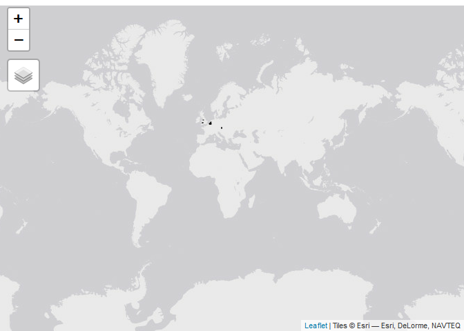

```{r setup, include=FALSE}
knitr::opts_chunk$set(echo = TRUE,
                      fig.path = "man/figures/")
```

<!-- badges: start -->

[](https://lifecycle.r-lib.org/articles/stages.html#experimental) [](https://www.repostatus.org/#active)

<!-- badges: end -->

This package provides wrappers for Telraam API calls

## Instalation

For the installation you need to have the `remotes` library.

```{r,eval=FALSE}
install.packages("remotes")
```

Once `remotes` is available. The package can be installed using the following code:

```{r,eval=FALSE}
remotes::install_github("juanfonsecaLS1/telraamR")
```

To load the package:

```{r}
library(telraamR)
```

## Set the Authentintication token

An authentication token is needed for using the Telraam API. If you do not have one, you can obtain one by registering in Telraam [here](https://www.telraam.net/en/register). Once you have obtained the token, it can be set using the following line of code:

```{r,eval=F}
usethis::edit_r_environ()
```

Save your token into the `.Renviron` file that is opened when you execute the command above and restart your session. You can check to see if the token has been loaded as follows:

```{r,eval=F}
Sys.getenv("telraam")
```

The authentication token can also be provided in the `mytoken` argument of functions that call the Telraam API.

## Usage

### Cameras

It is possible to obtain all camera instances registered on the server with the following code:

```{r}
cameras_summary <- read_telraam_cameras()

cameras_summary |> str()
```

### Segments Location

To obtain the location of the network links a.k.a. segments, the following function can be used:

```{r}
my_segments <- read_telraam_segments()

my_segments |> str()
```

The following code would show the location of all segments using the `tmap` library.

```{r map_segments, echo=TRUE,dpi=72,message=FALSE,eval=FALSE}
library(tmap)
tmap_mode("view")
tm_shape(my_segments) + tm_lines()
```



### Traffic data

The hourly report for a single site can be obtained using the `read_Telraam_traffic` function. The following code shows an example of the use:

```{r}
data <- read_telraam_traffic(9000003890,
  time_start = "2023-03-25 07:00:00",
  time_end = "2023-04-25 07:00:00",
  report = "per-hour",
  include_speed = FALSE
)
```

The function returns a data set with the hourly traffic by vehicle type and direction

```{r}
dim(data)
data |>
  str()
```

If the `include_speed` is set as `TRUE`. The returned data frame will include the binned speed distribution for cars

```{r,results='hide',warning=FALSE,message=FALSE}
library(tidyverse)
```

```{r}
data <- read_telraam_traffic(9000003890,
  time_start = "2023-03-25 07:00:00",
  time_end = "2023-04-25 07:00:00",
  report = "per-hour",
  include_speed = TRUE
)
dim(data)
data |>
  select(segment_id, date, starts_with("car speed")) |>
  str()
```

We can visualise the number of cars per day using the following code:

```{r cars_per_day}
data |>
  group_by(date) |>
  summarise(cars = sum(car)) |>
  ggplot(aes(x = date, y = cars)) +
  geom_line() +
  labs(x = "Date", y = "Number of cars")
```

#### Directional flows

Once the traffic data is available, the `tidy_directional` function can be used for formatting the traffic data:

```{r}
dir_data <- data |>
  tidy_directional()
dir_data
```

The new formatted data eases visualisations or analysis by direction. For example, the following code shows the median car hourly-flow by direction:

```{r directional_plot_car}
dir_data |>
  filter(type == "car") |>
  drop_na(date) |>
  ggplot(aes(x = hr, y = flow, col = road_dir)) +
  geom_line(aes(group = factor(date)), alpha = 0.2) +
  stat_summary(
    fun = median,
    geom = "line",
    linewidth = 1
  ) +
  facet_grid(. ~ road_dir) +
  labs(x = "Hour", y = "Cars per hour") +
  theme(legend.position = "none")
```
