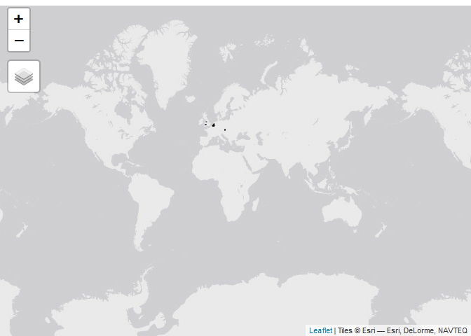

telraamR
================

<!-- badges: start -->

[](https://lifecycle.r-lib.org/articles/stages.html#experimental)
[](https://www.repostatus.org/#active)
[](https://github.com/juanfonsecaLS1/telraamR/actions/workflows/R-CMD-check.yaml)
<!-- badges: end -->

This package provides wrappers for Telraam API calls

## Instalation

For the installation you need to have the `remotes` library.

``` r
install.packages("remotes")
```

Once `remotes` is available. The package can be installed using the
following code:

``` r
remotes::install_github("juanfonsecaLS1/telraamR")
```

To load the package:

``` r
library(telraamR)
```

## Set the Authentintication token

An authentication token is needed for using the Telraam API. If you do
not have one, you can obtain one by registering in Telraam
[here](https://www.telraam.net/en/register). Once you have obtained the
token, it can be set using the following line of code:

``` r
usethis::edit_r_environ()
```

Save your token into the `.Renviron` file that is opened when you
execute the command above and restart your session. You can check to see
if the token has been loaded as follows:

``` r
Sys.getenv("telraam")
```

The authentication token can also be provided in the `mytoken` argument
of functions that call the Telraam API.

## Usage

### Cameras

It is possible to obtain all camera instances registered on the server
with the following code:

``` r
cameras_summary <- read_telraam_cameras()

cameras_summary |> str()
```

    ## tibble [7,997 × 19] (S3: tbl_df/tbl/data.frame)
    ##  $ instance_id        : num [1:7997] 6832 3558 1236 1359 5858 ...
    ##  $ mac                : num [1:7997] 3.50e+14 2.02e+14 2.02e+14 2.02e+14 2.02e+14 ...
    ##  $ user_id            : num [1:7997] 1648 3886 1778 1317 6299 ...
    ##  $ segment_id         : num [1:7997] 9e+09 9e+09 9e+09 9e+09 9e+09 ...
    ##  $ direction          : logi [1:7997] TRUE FALSE TRUE FALSE FALSE TRUE ...
    ##  $ status             : chr [1:7997] "active" "active" "active" "active" ...
    ##  $ manual             : logi [1:7997] FALSE FALSE FALSE FALSE FALSE FALSE ...
    ##  $ time_added         : POSIXct[1:7997], format: "2023-04-06 16:58:48" "2021-05-14 16:21:38" ...
    ##  $ time_end           : POSIXct[1:7997], format: NA NA ...
    ##  $ last_data_package  : POSIXct[1:7997], format: "2023-10-11 07:46:32" "2023-10-11 07:47:18" ...
    ##  $ first_data_package : POSIXct[1:7997], format: "2023-04-06 17:00:14" "2021-05-14 17:00:00" ...
    ##  $ pedestrians_left   : logi [1:7997] FALSE TRUE TRUE TRUE FALSE FALSE ...
    ##  $ pedestrians_right  : logi [1:7997] TRUE TRUE TRUE TRUE TRUE TRUE ...
    ##  $ bikes_left         : logi [1:7997] TRUE TRUE TRUE TRUE TRUE TRUE ...
    ##  $ bikes_right        : logi [1:7997] TRUE TRUE TRUE TRUE TRUE TRUE ...
    ##  $ cars_left          : logi [1:7997] TRUE TRUE TRUE TRUE TRUE TRUE ...
    ##  $ cars_right         : logi [1:7997] FALSE TRUE TRUE TRUE TRUE TRUE ...
    ##  $ is_calibration_done: chr [1:7997] "no" "yes" "partial" "yes" ...
    ##  $ hardware_version   : num [1:7997] 2 1 1 1 1 1 1 1 1 1 ...

### Segments Location

To obtain the location of the network links a.k.a. segments, the
following function can be used:

``` r
my_segments <- read_telraam_segments()

my_segments |> str()
```

    ## Classes 'sf' and 'data.frame':   6571 obs. of  2 variables:
    ##  $ oidn    : num  9e+09 9e+09 9e+09 9e+09 9e+09 ...
    ##  $ geometry:sfc_MULTILINESTRING of length 6571; first list element: List of 1
    ##   ..$ : num [1:5, 1:2] 3.3 3.3 3.3 3.3 3.3 ...
    ##   ..- attr(*, "class")= chr [1:3] "XY" "MULTILINESTRING" "sfg"
    ##  - attr(*, "sf_column")= chr "geometry"

The following code would show the location of all segments using the
`tmap` library.

``` r
library(tmap)
tmap_mode("view")
tm_shape(my_segments) + tm_lines()
```

``` r
knitr::include_graphics(path = "man/figures/map_segments-1.png")
```



### Traffic data

The hourly report for a single site can be obtained using the
`read_Telraam_traffic` function. The following code shows an example of
the use:

``` r
data <- read_telraam_traffic(9000003890,
  time_start = "2023-03-25 07:00:00",
  time_end = "2023-04-25 07:00:00",
  report = "per-hour",
  include_speed = FALSE
)
```

The function returns a data set with the hourly traffic by vehicle type
and direction

``` r
dim(data)
```

    ## [1] 720  22

``` r
data |>
  str()
```

    ## 'data.frame':    720 obs. of  22 variables:
    ##  $ instance_id   : num  -1 -1 -1 -1 -1 -1 -1 -1 -1 -1 ...
    ##  $ segment_id    : num  9e+09 9e+09 9e+09 9e+09 9e+09 ...
    ##  $ date          : Date, format: "2023-03-25" "2023-03-25" ...
    ##  $ interval      : chr  "hourly" "hourly" "hourly" "hourly" ...
    ##  $ uptime        : num  0.762 0.764 0.738 0.655 0.685 ...
    ##  $ heavy         : num  48.3 41.7 80.2 61.6 75.9 ...
    ##  $ car           : num  276 491 833 704 939 ...
    ##  $ bike          : num  10.1 28.8 33 100 50.7 ...
    ##  $ pedestrian    : num  1.24 5.45 5.42 2.91 22.62 ...
    ##  $ heavy_lft     : num  23.5 16.9 34.6 24.8 29.6 ...
    ##  $ heavy_rgt     : num  24.8 24.8 45.7 36.7 46.3 ...
    ##  $ car_lft       : num  108 228 366 348 417 ...
    ##  $ car_rgt       : num  168 263 467 356 521 ...
    ##  $ bike_lft      : num  5.04 11.74 9.04 42.52 29.98 ...
    ##  $ bike_rgt      : num  5.11 17.03 23.99 57.53 20.7 ...
    ##  $ pedestrian_lft: num  1.24 2.9 0 1.59 3.89 ...
    ##  $ pedestrian_rgt: num  0 2.55 5.42 1.33 18.73 ...
    ##  $ direction     : num  1 1 1 1 1 1 1 1 1 1 ...
    ##  $ timezone      : chr  "Europe/London" "Europe/London" "Europe/London" "Europe/London" ...
    ##  $ datetime      : POSIXct, format: "2023-03-25 07:00:00" "2023-03-25 08:00:00" ...
    ##  $ day           : num  6 6 6 6 6 6 6 6 6 6 ...
    ##  $ hr            : int  7 8 9 10 11 12 13 14 15 16 ...

If the `include_speed` is set as `TRUE`. The returned data frame will
include the binned speed distribution for cars

``` r
library(tidyverse)
```

``` r
data <- read_telraam_traffic(9000003890,
  time_start = "2023-03-25 07:00:00",
  time_end = "2023-04-25 07:00:00",
  report = "per-hour",
  include_speed = TRUE
)
dim(data)
```

    ## [1] 720  47

``` r
data |>
  select(segment_id, date, starts_with("car speed")) |>
  str()
```

    ## 'data.frame':    720 obs. of  27 variables:
    ##  $ segment_id          : num  9e+09 9e+09 9e+09 9e+09 9e+09 ...
    ##  $ date                : Date, format: "2023-03-25" "2023-03-25" ...
    ##  $ car speed  [0,5)    : num  0.926 0.555 2.129 2.478 0.702 ...
    ##  $ car speed  [5,10)   : num  0.451 1.109 0.318 2.102 0.535 ...
    ##  $ car speed  [10,15)  : num  3.787 2.878 1.662 2.287 0.981 ...
    ##  $ car speed  [15,20)  : num  2.772 1.286 0.963 2.065 0.798 ...
    ##  $ car speed  [20,25)  : num  1.823 0.773 1.161 3.412 4.086 ...
    ##  $ car speed  [25,30)  : num  2.3 2.44 4.96 7.36 10.97 ...
    ##  $ car speed  [30,35)  : num  5.62 10.56 12.19 12.98 16.94 ...
    ##  $ car speed  [35,40)  : num  19.9 12.7 18.5 16.1 23.9 ...
    ##  $ car speed  [40,45)  : num  18.1 19.1 18.3 18.1 18.3 ...
    ##  $ car speed  [45,50)  : num  17.9 14.5 14.2 11.4 11.3 ...
    ##  $ car speed  [50,55)  : num  11.38 11.86 8.51 6.31 5.34 ...
    ##  $ car speed  [55,60)  : num  4.24 6.6 4.68 4.92 2.93 ...
    ##  $ car speed  [60,65)  : num  2.698 3.725 3.018 3.154 0.699 ...
    ##  $ car speed  [65,70)  : num  1.882 0.811 3.093 1.989 0.835 ...
    ##  $ car speed  [70,75)  : num  1.872 2.69 1.289 1.654 0.424 ...
    ##  $ car speed  [75,80)  : num  2.871 1.844 1.491 0.487 0.275 ...
    ##  $ car speed  [80,85)  : num  0 0.553 0.818 0.3 0.142 ...
    ##  $ car speed  [85,90)  : num  0 1.032 0.493 0.414 0.281 ...
    ##  $ car speed  [90,95)  : num  0.535 1.697 0.508 0.828 0.142 ...
    ##  $ car speed  [95,100) : num  0 0.81 0.33 0.188 0.275 ...
    ##  $ car speed  [100,105): num  0.451 1.066 0.33 0 0 ...
    ##  $ car speed  [105,110): num  0 0.296 0.666 0 0.142 ...
    ##  $ car speed  [110,115): num  0 0 0.153 0.226 0 ...
    ##  $ car speed  [115,120): num  0 0 0.153 0.226 0 ...
    ##  $ car speed  120+     : num  0.535 1.144 0.153 1.015 0 ...

We can visualise the number of cars per day using the following code:

``` r
data |>
  group_by(date) |>
  summarise(cars = sum(car)) |>
  ggplot(aes(x = date, y = cars)) +
  geom_line() +
  labs(x = "Date", y = "Number of cars")
```

    ## Warning: Removed 1 row containing missing values (`geom_line()`).

<!-- -->

#### Directional flows

Once the traffic data is available, the `tidy_directional` function can
be used for formatting the traffic data:

``` r
dir_data <- data |>
  tidy_directional()
```

    ## Linking to GEOS 3.11.2, GDAL 3.6.2, PROJ 9.2.0; sf_use_s2() is TRUE

``` r
dir_data
```

    ## # A tibble: 5,760 × 10
    ##    segment_id uptime timezone      date       datetime              day    hr
    ##         <dbl>  <dbl> <chr>         <date>     <dttm>              <dbl> <int>
    ##  1 9000003890  0.762 Europe/London 2023-03-25 2023-03-25 07:00:00     6     7
    ##  2 9000003890  0.762 Europe/London 2023-03-25 2023-03-25 07:00:00     6     7
    ##  3 9000003890  0.762 Europe/London 2023-03-25 2023-03-25 07:00:00     6     7
    ##  4 9000003890  0.762 Europe/London 2023-03-25 2023-03-25 07:00:00     6     7
    ##  5 9000003890  0.762 Europe/London 2023-03-25 2023-03-25 07:00:00     6     7
    ##  6 9000003890  0.762 Europe/London 2023-03-25 2023-03-25 07:00:00     6     7
    ##  7 9000003890  0.762 Europe/London 2023-03-25 2023-03-25 07:00:00     6     7
    ##  8 9000003890  0.762 Europe/London 2023-03-25 2023-03-25 07:00:00     6     7
    ##  9 9000003890  0.764 Europe/London 2023-03-25 2023-03-25 08:00:00     6     8
    ## 10 9000003890  0.764 Europe/London 2023-03-25 2023-03-25 08:00:00     6     8
    ## # ℹ 5,750 more rows
    ## # ℹ 3 more variables: road_dir <chr>, type <chr>, flow <dbl>

The new formatted data eases visualisations or analysis by direction.
For example, the following code shows the median car hourly-flow by
direction:

``` r
dir_data |>
  filter(type == "car") |>
  drop_na(date) |>
  ggplot(aes(x = hr, y = flow, col = road_dir)) +
  geom_line(aes(group = factor(date)), alpha = 0.2) +
  stat_summary(
    fun = median,
    geom = "line",
    linewidth = 1
  ) +
  facet_grid(. ~ road_dir) +
  labs(x = "Hour", y = "Cars per hour") +
  theme(legend.position = "none")
```

<!-- -->
